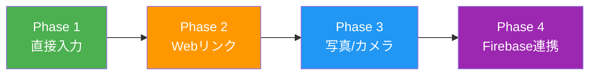

# レシピ新規追加機能 — 実装プラン

このドキュメントは、レシピの新規登録・AI解析・永続化までの実装ステップを管理するものです。

## おすすめの実装順

---

## Phase 1: 直接入力（手動登録） ✅ (完了)

外部依存ゼロで「空のレシピ作成 → 編集 → 一覧に追加」のフローを完成させた。

- [x] **レシピ状態管理**: `RecipeContext.tsx` によるローカルstate管理
- [x] **新規作成画面**: `app/recipe/new.tsx` の実装
- [x] **既存ファイル修正**: `index.tsx`, `[id].tsx`, `edit/[id].tsx`, `_layout.tsx` のContext連携
- [x] **削除機能**: 編集画面最下部への削除ボタン追加

---

## Phase 2: AI自動解析（Webリンク・テキスト） ✅ (完了)

テキストやURLからGemini APIでレシピを自動解析する機能を実装した。

- [x] **Gemini API連携**: `services/geminiService.ts` に解析ロジックを実装
- [x] **テキスト貼り付け画面**: `app/recipe/add-text.tsx` の実装
- [x] **URL入力画面**: `app/recipe/add-link.tsx` の実装（※技術制限により現在は限定的）
- [x] **プレビュー機能**: `app/recipe/preview.tsx` で解析結果の確認・修正フローを構築
- [x] **ナビゲーション更新**: 各画面間の遷移を統合

---

## Phase 3: 写真/カメラからの登録 ✅ (完了)

画像をGemini APIで解析する機能を実装した。

### 画像選択フロー
- [x] `index.tsx` のモーダルからカメラ・アルバム起動の実装
- [x] 取得した画像URIを `preview.tsx` へ渡す
- [x] `app/recipe/add-photo.tsx` の新規作成

### Gemini API連携の拡張
- [x] 画像（Base64）をGemini APIで解析する機能を追加（`extractRecipeFromImage`）

---

## Phase 4: Firebase連携（データ永続化） 🟣

ローカルstate管理からFirestoreへ移行し、データを永続化する。

### Firebase セットアップ
- `firebaseConfig.ts` の作成と初期化

### RecipeContext の更新
- CRUD操作をFirestoreへの読み書きに置き換え
- 画像をFirebase Storageにアップロード
