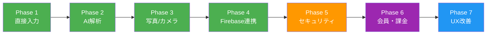

# レシピ新規追加機能 — 実装プラン

このドキュメントは、レシピの新規登録・AI解析・永続化までの実装ステップを管理するものです。

## 全体ロードマップ

> 🟢 完了 | 🟠 次に着手 | 🟣 将来

---

## Phase 1: 直接入力（手動登録） ✅ 完了

外部依存ゼロで「空のレシピ作成 → 編集 → 一覧に追加」のフローを完成させた。

- [x] **レシピ状態管理**: `RecipeContext.tsx` によるローカルstate管理
- [x] **新規作成画面**: `app/recipe/new.tsx` の実装
- [x] **既存ファイル修正**: `index.tsx`, `[id].tsx`, `edit/[id].tsx`, `_layout.tsx` のContext連携
- [x] **削除機能**: 編集画面最下部への削除ボタン追加

---

## Phase 2: AI自動解析（Webリンク・テキスト） ✅ 完了

テキストやURLからGemini APIでレシピを自動解析する機能を実装した。

- [x] **Gemini API連携**: `services/geminiService.ts` に解析ロジックを実装
- [x] **テキスト貼り付け画面**: `app/recipe/add-text.tsx` の実装
- [x] **URL入力画面**: `app/recipe/add-link.tsx` の実装（※技術制限により現在は限定的）
- [x] **プレビュー機能**: `app/recipe/preview.tsx` で解析結果の確認・修正フローを構築
- [x] **ナビゲーション更新**: 各画面間の遷移を統合

---

## Phase 3: 写真/カメラからの登録 ✅ 完了

画像をGemini APIで解析する機能を実装した。

### 画像選択フロー
- [x] `index.tsx` のモーダルからカメラ・アルバム起動の実装
- [x] 取得した画像URIを `preview.tsx` へ渡す
- [x] `app/recipe/add-photo.tsx` の新規作成

### Gemini API連携の拡張
- [x] 画像（Base64）をGemini APIで解析する機能を追加（`extractRecipeFromImage`）

---

## Phase 4: Firebase連携（データ永続化） ✅ 完了

ローカルstate管理からFirestoreへ移行し、データを永続化した。

### Firebase セットアップ
- [x] Firebaseプロジェクト作成（`hapicook-14d13`, リージョン: `asia-northeast1`）
- [x] `services/firebaseConfig.ts` の作成（環境変数による設定管理）
- [x] Web/ネイティブ両対応のAuth初期化（`Platform.OS` で分岐）

### 認証（Authentication）
- [x] 匿名認証（Anonymous Sign-In）の有効化
- [x] アプリ起動時の自動匿名ログイン実装
- [x] Email/Password認証の有効化（将来用に設定のみ）

### Firestore（データベース）
- [x] レシピCRUD操作をFirestoreに接続
- [x] `onSnapshot` によるリアルタイム同期
- [x] 楽観的更新（Optimistic Update）パターンの採用
- [x] 初回起動時のサンプルレシピ自動投入（二重投入防止付き）

### Firebase Storage（画像保存）
- [x] `services/storageService.ts` の作成
- [x] レシピ保存時にローカル画像をStorageにアップロード
- [x] Firestoreの `image` フィールドを永続URLに自動更新
- [x] レシピ削除時にStorage画像も同時削除

### その他の修正
- [x] `ImagePicker.MediaTypeOptions`（非推奨）→ `MediaType[]` に更新（4ファイル5箇所）

---

## Phase 5: セキュリティ強化 ✅ 完了

Firestore、Storage、APIキーのすべてに制限をかけ、本番運用可能なセキュリティレベルに到達。

### Firestoreセキュリティルール ✅ 完了
- [x] ユーザーは自分のレシピのみ読み書き可能にする（`userId == request.auth.uid`）
- [x] `users` コレクションのアクセス制御（自分のドキュメントのみ）
- [x] 未認証ユーザーのアクセス拒否

### Storageセキュリティルール ✅ 完了
- [x] ユーザーは自分のフォルダ（`users/{uid}/`）のみ読み書き可能にする
- [x] アップロードファイルサイズの上限設定（例: 5MB）
- [x] 画像ファイル形式の制限（image/jpeg, image/png のみ）

### API キーの保護 ✅ 完了
- [x] Firebase API キーの使用制限設定（Identity Toolkit, Firestore, Storage, Gemini）
- [x] Gemini API キーの権限制限設定

---

## Phase 6: 会員システム・課金 🟣 将来

仕様書 Section 4.2 に基づく会員・課金機能の実装。

### Google Sign-In（認証の強化）
- [ ] Google Sign-In の実装
- [ ] 匿名アカウントからGoogleアカウントへのリンク機能
- [ ] ユーザープロフィール画面の作成

### ユーザー管理（usersコレクション）
- [ ] `users` コレクションの初期化（UID, isPremium, usage 等）
- [ ] レシピ登録数のカウント管理
- [ ] AI解析回数の月次カウント・リセット機能

### Free / Premium 制限
- [ ] Free会員: レシピ登録上限 50件の制限チェック
- [ ] Free会員: AI解析 月10回の制限チェック
- [ ] 上限到達時のアップグレード誘導UI

### 収益化（RevenueCat + AdMob）
- [ ] RevenueCat SDK の導入（サブスクリプション管理）
- [ ] Premium プランの設定（月額/年額）
- [ ] AdMob SDK の導入
- [ ] リワード広告の実装（AI解析回数回復）
- [ ] バナー広告の配置（Free版のみ）

---

## Phase 7: UX改善・追加機能 🟣 将来

アプリの完成度を上げるための機能追加。

### レシピ閲覧の改善
- [ ] Cooking Mode（常時点灯）の実装
- [ ] Split View（材料と手順の同時表示）
- [ ] レシピの検索・フィルタリング機能

### AI機能の拡張
- [ ] AI画像生成（Premium機能）— レシピから料理完成予想図を生成
- [ ] レシピ提案機能 — 保存済み食材からおすすめレシピを提案

### データ管理
- [ ] レシピのエクスポート/インポート
- [ ] 家族共有機能（Premium）— 複数端末でのリアルタイム同期

### Share Extension
- [ ] iOS/Android のShareメニューからレシピURLを直接取り込む
- [ ] Expo Share Intent の導入

---

## 技術的な既知の課題

| 課題 | 影響 | 優先度 | 備考 |
| :--- | :--- | :--- | :--- |
| Firestore/Storageがテストモード | セキュリティリスク | **高** | Phase 5 で対応 |
| Webリンク取り込みの制限（CORS） | Web版でURL取り込みが困難 | 中 | Cloud Functions等で解決可能 |
| `shadow*` StyleSheet 非推奨警告 | 動作に影響なし | 低 | React Native Web側の問題 |
| `getReactNativePersistence` 型エラー | ビルド・動作に影響なし | 低 | TypeScript定義の問題のみ |
